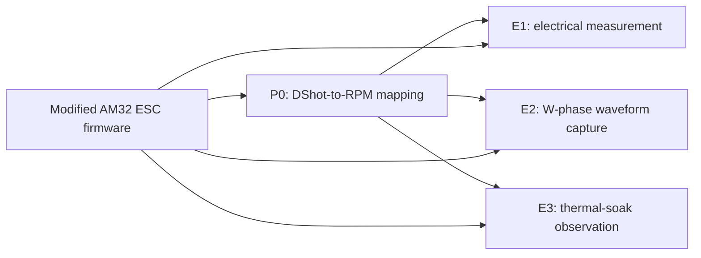

<div align="center">

# STM32 BLDC ESC Experiments

**My STM32-based BLDC ESC bench firmware, DShot tooling, and AM32 FYP development branch**

<p>
  
  
  
  
  
</p>

</div>

---

## About

This repository is my engineering workspace for BLDC ESC bench experiments built around STM32 controllers, DShot output, and a modified AM32 firmware branch.

The work started during my XJTLU Final Year Project, where I compared a silicon MOSFET ESC route with a GaN ESC route under matched same-RPM operating points. I am keeping the dissertation and school submission material out of this repository; the paper archive lives in [`XJTLU-Legacy`](https://github.com/Awes0meE/XJTLU-Legacy). This repository is for firmware, test controllers, and code I may keep improving.

## Repository Map

| Folder | Role |
|---|---|
| [`AM32-firmware-FYP-modified`](./AM32-firmware-FYP-modified) | Modified AM32 firmware workspace used for FYP ESC development, AT32F421 direct flashing, VS Code/DAPLink debugging, and experiment-specific ESC settings |
| [`STM32_ESC_Dshot_P0_RPM_Mapping`](./STM32_ESC_Dshot_P0_RPM_Mapping) | P0 DShot-to-RPM mapping helper used before same-RPM tests |
| [`STM32_ESC_Dshot_E1`](./STM32_ESC_Dshot_E1) | E1 same-RPM electrical measurement firmware with HC-05 control, ADC logging, OLED status, and three-cycle test flow |
| [`STM32_ESC_Dshot_E2`](./STM32_ESC_Dshot_E2) | E2 W-phase waveform capture firmware with PB0 oscilloscope marker and long capture window |
| [`STM32_ESC_Dshot_E3`](./STM32_ESC_Dshot_E3) | E3 thermal-soak firmware with OLED guidance, local button control, ADC values, and PB0 checkpoint pulses |
| [`STM32_ESC_Telemetry_Test`](./STM32_ESC_Telemetry_Test) | Single-motor bench demo controller with ELRS/CRSF input, arm/disarm logic, DShot output, OLED, HC-05 status, and protection checks |

## Experiment Chain

The same-RPM workflow is organized as:



P0 is a calibration and logging helper. It holds selected DShot commands while RPM is measured externally with a handheld tachometer. The resulting command table is then used by E1, E2, and E3.

The final same-RPM profile table used across the experiment firmware is:

| Profile | ESC route | RPM point | Target RPM | DShot command |
|---:|---|---|---:|---:|
| `P1` | Si | `R1` | `3000` | `551` |
| `P2` | Si | `R2` | `6500` | `786` |
| `P3` | Si | `R3` | `10000` | `1124` |
| `P4` | GaN | `R1` | `3000` | `540` |
| `P5` | GaN | `R2` | `6500` | `762` |
| `P6` | GaN | `R3` | `10000` | `1022` |

## Firmware Overview

### AM32 FYP branch

The AM32 workspace is not a clean upstream mirror. It is my research-development branch for the FYP platform.

Important changes include:

- AT32F421 direct-flash layout from `0x08000000` for VS Code and DAPLink development.
- Experiment-specific ESC settings moved into `Inc/ESC_Settings.h`.
- Runtime overrides for motor poles, KV, one-way aircraft ESC behavior, PWM mode, startup behavior, brake values, and fixed timing advance.
- A disabled fixed-speed path kept for staged RPM testing.
- OpenOCD/DAPLink workflow files and VS Code build/flash/debug configuration.

### P0 RPM mapping

P0 keeps the ESC at selected raw DShot commands and records voltage, current, power, and step metadata over serial. It does not measure RPM directly. I use it to build the command-to-RPM table before running E1/E2/E3.

### E1 electrical measurement

E1 runs three same-profile cycles with DShot300, HC-05 serial control, ADC + DMA current/voltage sampling, FireWater/VOFA-friendly logs, OLED status, and overcurrent safety behavior.

### E2 waveform capture

E2 holds one selected same-RPM profile and drives `PB0` high during the capture window so oscilloscope screenshots can align firmware timing with the ESC W-phase waveform.

### E3 thermal observation

E3 is a local thermal-test controller. It uses a long heat-soak window, OLED checkpoint reminders, ADC-derived values, and `PB0` marker pulses at `0 / 30 / 60 / 120 / 300 / 600 s`.

### Telemetry bench controller

The telemetry test project is a single-motor bench demo controller. It adds ELRS/CRSF input, arm/disarm gates, failsafe behavior, local emergency stop, DShot output, OLED status, HC-05 telemetry, and conservative software-side protection checks.

## Common Hardware Baseline

Most STM32 bench controller projects are built around an `STM32F103C8T6 Blue Pill` board.

| Pin | Common role |
|---|---|
| `PB8 / TIM4_CH3` | ESC DShot signal output |
| `PA0 / ADC1_IN0` | Current-sense amplifier output |
| `PA1 / ADC1_IN1` | Battery voltage divider midpoint |
| `PA9 / PA10` | HC-05 serial link |
| `PB12` | HC-05 STATE input |
| `PB13` | Local button |
| `PB6 / PB7` | I2C OLED |
| `PB0` | Scope / thermal marker in E2 and E3 |
| `PC13` | Status LED |
| `PA13 / PA14` | SWD |

Keep the DShot timer configuration aligned with each project's README and CubeMX file. The F103 DShot projects rely on `TIM4_CH3` and DMA timing; careless CubeMX regeneration can break the signal output.

## Build

Most STM32F103 projects use CMake presets:

```bash
cmake --preset Debug --fresh
cmake --build --preset Debug
```

Typical outputs are placed under `build/Debug/` as `.elf`, `.hex`, and `.bin` files.

The AM32 workspace follows its own upstream-style layout and can be built through Keil projects or the configured VS Code / GCC workflow, depending on the target and local toolchain paths.

## Safety

These projects drive real ESCs, motors, power supplies, and switching nodes. I treat this repository as bench firmware, not a flight-ready control stack.

- Remove propellers or use a safe fixture whenever possible.
- Verify common ground before connecting oscilloscope probes.
- Treat ESC phase nodes as high-energy switching nodes.
- Do not rely on software protection as the only safety layer.
- Re-check DShot output, current scale, voltage divider ratio, and profile command before each bench setup.

## Archive and Development Policy

This combined repository is a folder-level snapshot of the original project repositories, with the current files preserved in their own subdirectories. The old per-repository Git histories are not embedded here.

I expect this repository to keep evolving as a technical project. The old school-facing dissertation and assignment archive stays separate so this repo can remain focused on firmware and bench-test engineering.

## License Notes

The modified AM32 folder inherits the upstream AM32 licensing context. Other folders contain my STM32 bench firmware and project files from the original repositories. No new root-level license is added by this consolidation.
