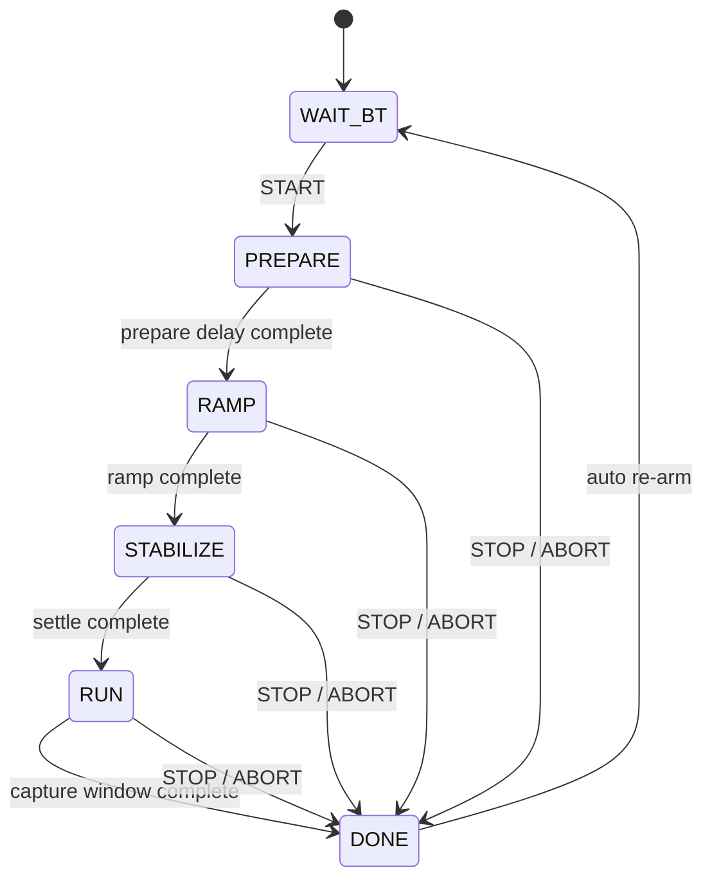
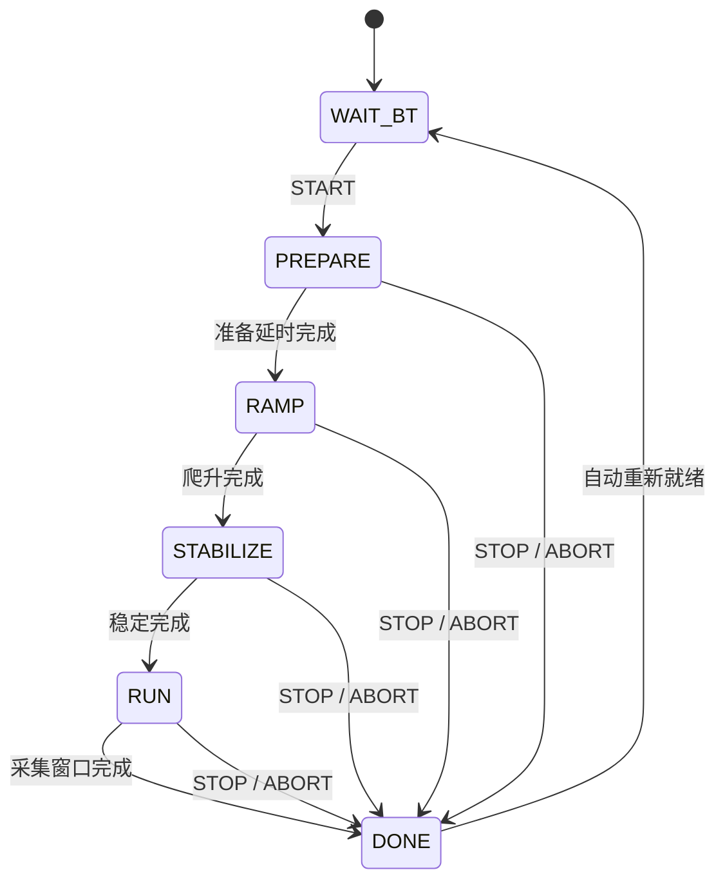

<div align="center">

# STM32 ESC DShot E2 Scope Firmware

**E2 same-RPM ESC W-phase waveform capture firmware**  
**E2 同转速 ESC W 相波形采集固件**

<p>
  
  
  
  
  
  
</p>

</div>

---

## Contents

- [English](#english)
  - [1. Purpose](#1-purpose)
  - [2. Hardware Setup](#2-hardware-setup)
  - [3. Experiment Workflow](#3-experiment-workflow)
  - [4. P0 Same-RPM Profiles](#4-p0-same-rpm-profiles)
  - [5. Control Interface](#5-control-interface)
  - [6. OLED Display](#6-oled-display)
  - [7. Firmware Map](#7-firmware-map)
  - [8. Build](#8-build)
  - [9. E2 Result Evidence](#9-e2-result-evidence)
- [中文](#中文)
  - [1. 目的](#1-目的)
  - [2. 硬件配置](#2-硬件配置)
  - [3. 实验流程](#3-实验流程)
  - [4. P0 同转速 Profile](#4-p0-同转速-profile)
  - [5. 控制接口](#5-控制接口)
  - [6. OLED 显示](#6-oled-显示)
  - [7. 固件结构](#7-固件结构)
  - [8. 编译](#8-编译)
  - [9. E2 结果证据](#9-e2-结果证据)

---

# English

## 1. Purpose

This firmware is designed for the final **E2 ESC phase-node waveform experiment**. The STM32F103C8T6 sends DShot300 commands to the ESC at matched-RPM operating points, while an oscilloscope captures the relationship between the firmware capture window and the ESC W-phase switching waveform.

| Scope channel | Signal | Purpose |
|---|---|---|
| CH1 | `PB0` marker | Marks the exact firmware `RUN` capture window |
| CH2 | ESC `W` phase pad | Captures the W-phase switching waveform |

The E2 evidence package is based on oscilloscope screenshots. The firmware handles local timing, profile selection, DShot output, PB0 marking, and a compact operator control interface.

## 2. Hardware Setup

### STM32 to ESC

| STM32 / board point | ESC / external point | Required | Description |
|---|---|---:|---|
| `PB8 / TIM4_CH3` | ESC throttle signal pad | Yes | DShot300 throttle output |
| STM32 `GND` | ESC `GND` | Yes | Shared reference ground |
| `PB0` | Oscilloscope CH1 tip | Yes | Capture-window marker |
| ESC `W` phase pad | Oscilloscope CH2 tip | Yes | Phase-node waveform target |

### Oscilloscope probing

| Probe | Connect to | Expected behavior |
|---|---|---|
| CH1 tip | `PB0` | LOW outside `RUN`, HIGH during `RUN` |
| CH2 tip | ESC `W` phase pad | W-phase switching waveform |
| Probe ground clips | Common ground | Shared measurement reference |

> Practical safety note: the ESC W phase pad is a switching node. Use a probe setup suitable for your oscilloscope and power system, and keep ground clips on the common ground reference.

## 3. Experiment Workflow



| State | Default duration | DShot output | PB0 marker | Operator focus |
|---|---:|---|---|---|
| `WAIT_BT` | Until connected and started | `0` | LOW | Select the profile and send `START` |
| `PREPARE` | `10000 ms` | `0` | LOW | Prepare the oscilloscope |
| `RAMP` | `5000 ms` | Starts at `500`, then ramps to the selected profile command | LOW | Let the ESC accelerate |
| `STABILIZE` | `10000 ms` | Selected profile command | LOW | Wait for steady operation |
| `RUN` | `300000 ms` | Selected profile command | HIGH | Save W-phase waveform screenshots |
| `DONE` | `5000 ms` re-arm delay | `0` | LOW | Prepare the next profile |

## 4. P0 Same-RPM Profiles

| Profile | Board | RPM point | Target RPM | DShot command |
|---:|---|---|---:|---:|
| `P1` | Si | `R1` | `3000` | `551` |
| `P2` | Si | `R2` | `6500` | `786` |
| `P3` | Si | `R3` | `10000` | `1124` |
| `P4` | GaN | `R1` | `3000` | `540` |
| `P5` | GaN | `R2` | `6500` | `762` |
| `P6` | GaN | `R3` | `10000` | `1022` |

The profile table is configured in `Core/Inc/app_e2_waveform.h`. Before a session starts, PB13 cycles through the profiles in the table order.

## 5. Control Interface

| Interface | Pin / command | Role |
|---|---|---|
| HC-05 state | `PB12` | Confirms Bluetooth connection before accepting `START` |
| UART TX/RX | `PA9 / PA10`, `9600 baud` | Receives commands and prints short status lines |
| Profile command | `P1` ... `P6` | Selects one same-RPM profile |
| Alias command | `SI_R1` ... `GAN_R3` | Selects a profile by board/RPM label |
| Start command | `START` | Starts `PREPARE -> RAMP -> STABILIZE -> RUN` |
| Stop command | `STOP` or `ABORT` | Sends DShot stop and ends the current session |
| Button | `PB13` | Cycles profiles before `START` |

## 6. OLED Display

| OLED line | Example | Meaning |
|---:|---|---|
| 1 | `E2 WAVE` | E2 waveform firmware |
| 2 | `W PHASE` | Scope target is ESC W phase |
| 3 | `PB0 MARK` | Marker output is PB0 |
| 4 | `P4 GANR1 CMD 540` | Selected profile and DShot command |
| 5 | `CAP  42S` | State countdown or capture elapsed time |

## 7. Firmware Map

| File | Role |
|---|---|
| `Core/Src/app_e2_waveform.c` | E2 state machine, DShot output, PB0 marker, UART commands, OLED |
| `Core/Inc/app_e2_waveform.h` | Timing constants and P0 profile commands |
| `Core/Src/main.c` | HAL startup and E2 task loop |
| `Core/Src/tim.c` | TIM4 PWM setup for DShot waveform generation |
| `Core/Src/dma.c` | DMA setup for TIM4_CH3 DShot frame transmission |
| `STM32_ESC_DSHOT_E2.ioc` | CubeMX project configuration |
| `cmake/stm32cubemx/CMakeLists.txt` | CMake source and driver configuration |

## 8. Build

```powershell
cmake --preset Debug --fresh
cmake --build --preset Debug
```

Optional release build:

```powershell
cmake --preset Release --fresh
cmake --build --preset Release
```

| Preset | Output folder | Main artifacts |
|---|---|---|
| Debug | `build/Debug/` | `STM32_ESC_DSHOT_E2.elf`, `.hex`, `.bin` |
| Release | `build/Release/` | `STM32_ESC_DSHOT_E2.elf`, `.hex`, `.bin` |

## 9. E2 Result Evidence

| Evidence item | Format |
|---|---|
| PB0 marker + ESC W-phase waveform | Oscilloscope screenshot |
| Profile and RPM label | Filename or result folder name |

External run metadata can be recorded beside the screenshots:

| Metadata field | Source |
|---|---|
| Profile ID | `P1` ... `P6` |
| Board type | Profile table: `Si` or `GaN` |
| RPM point | Profile table: `R1`, `R2`, or `R3` |
| Target RPM | Fixed P0 profile mapping |
| DShot command | Fixed P0 profile mapping |
| Screenshot filename | Oscilloscope save result |

The target RPM is treated as the validated profile value from P0, so E2 runs can focus on waveform capture.

Recommended screenshot naming:

```text
E2_P1_Si_R1_3000rpm_W_phase.png
E2_P4_GaN_R1_3000rpm_W_phase.png
```

---

# 中文

## 1. 目的

这一版固件面向最终 **E2 电调相节点波形实验**。STM32F103C8T6 在同转速工作点向电调输出 DShot300 指令，示波器同步记录固件采集窗口与电调 W 相开关波形之间的关系。

| 示波器通道 | 信号 | 用途 |
|---|---|---|
| CH1 | `PB0` marker | 标记固件真正处于 `RUN` 采集窗口的时间段 |
| CH2 | 电调 `W` 相焊盘 | 采集 W 相开关波形 |

E2 证据包以示波器截图为核心。固件负责本地时序、profile 选择、DShot 输出、PB0 标记和简洁的操作员控制接口。

## 2. 硬件配置

### STM32 到电调

| STM32 / 板上点位 | 电调 / 外部点位 | 必须 | 说明 |
|---|---|---:|---|
| `PB8 / TIM4_CH3` | 电调油门信号焊盘 | 是 | DShot300 油门输出 |
| STM32 `GND` | 电调 `GND` | 是 | 共地参考 |
| `PB0` | 示波器 CH1 探头尖端 | 是 | 采集窗口 marker |
| 电调 `W` 相焊盘 | 示波器 CH2 探头尖端 | 是 | 相节点波形目标 |

### 示波器探测

| 探头 | 连接位置 | 预期现象 |
|---|---|---|
| CH1 探头尖端 | `PB0` | `RUN` 外为 LOW，`RUN` 内为 HIGH |
| CH2 探头尖端 | 电调 `W` 相焊盘 | W 相开关波形 |
| 探头地夹 | 公共地 | 共享测量参考 |

> 实验安全提示：电调 W 相焊盘是高速开关节点。请使用适合示波器和供电系统的探头方式，地夹只接公共地。

## 3. 实验流程



| 状态 | 默认时长 | DShot 输出 | PB0 marker | 操作重点 |
|---|---:|---|---|---|
| `WAIT_BT` | 直到连接并启动 | `0` | LOW | 选择 profile，发送 `START` |
| `PREPARE` | `10000 ms` | `0` | LOW | 准备示波器 |
| `RAMP` | `5000 ms` | 从 `500` 开始，爬升到所选 profile 指令 | LOW | 等待电调加速 |
| `STABILIZE` | `10000 ms` | 所选 profile 指令 | LOW | 等待进入稳定运行 |
| `RUN` | `300000 ms` | 所选 profile 指令 | HIGH | 保存 W 相波形截图 |
| `DONE` | `5000 ms` 后重新就绪 | `0` | LOW | 准备下一组 profile |

## 4. P0 同转速 Profile

| Profile | 板子 | RPM 点 | 目标 RPM | DShot 指令 |
|---:|---|---|---:|---:|
| `P1` | Si | `R1` | `3000` | `551` |
| `P2` | Si | `R2` | `6500` | `786` |
| `P3` | Si | `R3` | `10000` | `1124` |
| `P4` | GaN | `R1` | `3000` | `540` |
| `P5` | GaN | `R2` | `6500` | `762` |
| `P6` | GaN | `R3` | `10000` | `1022` |

Profile 表配置在 `Core/Inc/app_e2_waveform.h` 中。开始实验前，PB13 会按表格顺序循环选择 profile。

## 5. 控制接口

| 接口 | 引脚 / 命令 | 作用 |
|---|---|---|
| HC-05 state | `PB12` | 确认蓝牙连接后才接受 `START` |
| UART TX/RX | `PA9 / PA10`, `9600 baud` | 接收命令，并输出少量状态提示 |
| Profile 命令 | `P1` ... `P6` | 选择同转速 profile |
| 别名命令 | `SI_R1` ... `GAN_R3` | 按板子 / RPM 标签选择 profile |
| 启动命令 | `START` | 开始 `PREPARE -> RAMP -> STABILIZE -> RUN` |
| 停止命令 | `STOP` 或 `ABORT` | 发送 DShot stop 并结束当前实验轮次 |
| 按钮 | `PB13` | `START` 前循环选择 profile |

## 6. OLED 显示

| OLED 行 | 示例 | 含义 |
|---:|---|---|
| 1 | `E2 WAVE` | E2 波形固件 |
| 2 | `W PHASE` | 示波器目标为电调 W 相 |
| 3 | `PB0 MARK` | marker 输出为 PB0 |
| 4 | `P4 GANR1 CMD 540` | 所选 profile 与 DShot 指令 |
| 5 | `CAP  42S` | 状态倒计时或采集已进行时间 |

## 7. 固件结构

| 文件 | 作用 |
|---|---|
| `Core/Src/app_e2_waveform.c` | E2 状态机、DShot 输出、PB0 marker、UART 命令、OLED |
| `Core/Inc/app_e2_waveform.h` | 时序常量与 P0 profile 指令 |
| `Core/Src/main.c` | HAL 启动与 E2 任务循环 |
| `Core/Src/tim.c` | TIM4 PWM，用于生成 DShot 波形 |
| `Core/Src/dma.c` | TIM4_CH3 DShot 帧传输所需 DMA 配置 |
| `STM32_ESC_DSHOT_E2.ioc` | CubeMX 工程配置 |
| `cmake/stm32cubemx/CMakeLists.txt` | CMake 源文件与驱动配置 |

## 8. 编译

```powershell
cmake --preset Debug --fresh
cmake --build --preset Debug
```

可选 Release 编译：

```powershell
cmake --preset Release --fresh
cmake --build --preset Release
```

| Preset | 输出目录 | 主要文件 |
|---|---|---|
| Debug | `build/Debug/` | `STM32_ESC_DSHOT_E2.elf`, `.hex`, `.bin` |
| Release | `build/Release/` | `STM32_ESC_DSHOT_E2.elf`, `.hex`, `.bin` |

## 9. E2 结果证据

| 证据项 | 格式 |
|---|---|
| PB0 marker + 电调 W 相波形 | 示波器截图 |
| Profile 与 RPM 标识 | 文件名或结果文件夹名 |

截图旁边可以记录这组外部元数据：

| 元数据字段 | 来源 |
|---|---|
| Profile ID | `P1` ... `P6` |
| 板子类型 | Profile 表：`Si` 或 `GaN` |
| RPM 点 | Profile 表：`R1`、`R2` 或 `R3` |
| 目标 RPM | P0 固定 profile 映射 |
| DShot 指令 | P0 固定 profile 映射 |
| 截图文件名 | 示波器保存结果 |

目标 RPM 采用 P0 已验证的 profile 值，E2 实验集中采集波形。

推荐截图命名：

```text
E2_P1_Si_R1_3000rpm_W_phase.png
E2_P4_GaN_R1_3000rpm_W_phase.png
```
