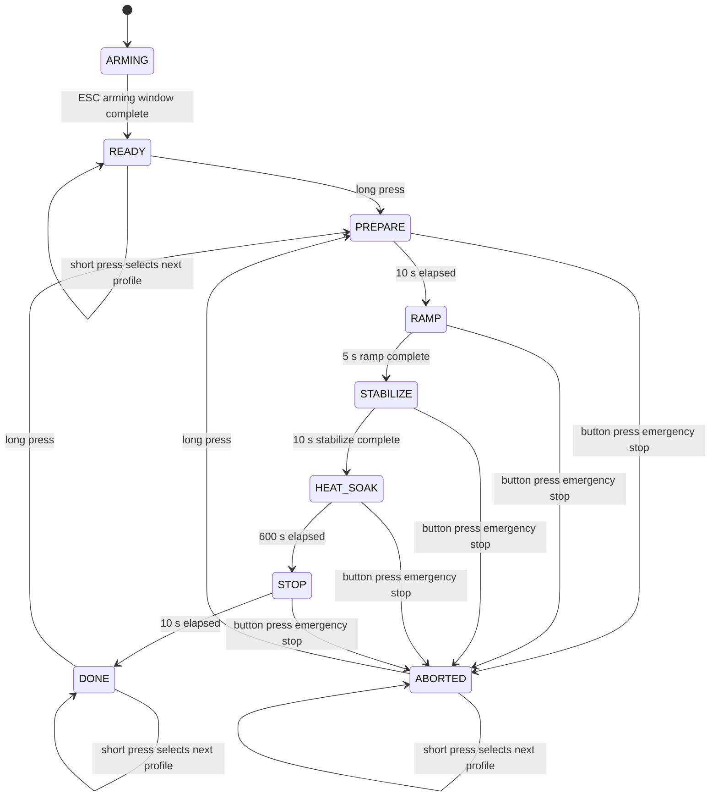
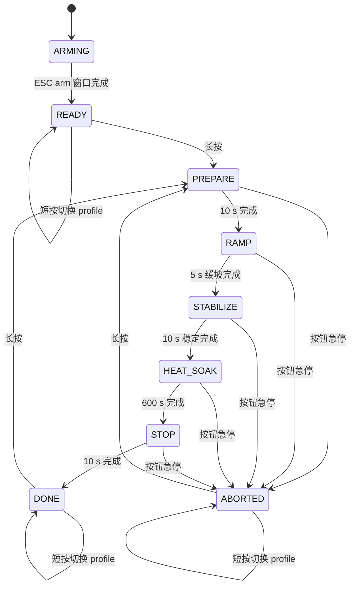

<div align="center">

# STM32 ESC DShot E3 Thermal Firmware

**E3 local ESC thermal behavior firmware with OLED guidance and PB0 marker pulses**<br>
**E3 本地 ESC 热行为测试固件，带 OLED 操作提示和 PB0 同步 marker 脉冲**

<p>
  
  
  
  
  
  
</p>

</div>

---

## Contents

- [English](#english)
  - [1. Purpose](#1-purpose)
  - [2. Current Firmware Behavior](#2-current-firmware-behavior)
  - [3. Experiment Workflow](#3-experiment-workflow)
  - [4. P0 Same-RPM Profiles](#4-p0-same-rpm-profiles)
  - [5. Control Interface](#5-control-interface)
  - [6. OLED Display](#6-oled-display)
  - [7. Thermal Checkpoints and Marker Pulses](#7-thermal-checkpoints-and-marker-pulses)
  - [8. Analog Sampling and Derived Values](#8-analog-sampling-and-derived-values)
  - [9. Hardware Setup](#9-hardware-setup)
  - [10. Firmware Map](#10-firmware-map)
  - [11. CubeMX and Timing Notes](#11-cubemx-and-timing-notes)
  - [12. Key Configurable Macros](#12-key-configurable-macros)
  - [13. Build](#13-build)
  - [14. Current Scope](#14-current-scope)
- [中文](#中文)
  - [1. 目的](#1-目的)
  - [2. 当前固件行为](#2-当前固件行为)
  - [3. 实验流程](#3-实验流程)
  - [4. P0 同转速 Profile](#4-p0-同转速-profile)
  - [5. 控制接口](#5-控制接口)
  - [6. OLED 显示](#6-oled-显示)
  - [7. 热像时间点与 Marker 脉冲](#7-热像时间点与-marker-脉冲)
  - [8. 模拟采样与导出量](#8-模拟采样与导出量)
  - [9. 硬件配置](#9-硬件配置)
  - [10. 固件结构](#10-固件结构)
  - [11. CubeMX 与时序要点](#11-cubemx-与时序要点)
  - [12. 关键可调宏](#12-关键可调宏)
  - [13. 编译](#13-编译)
  - [14. 当前版本边界](#14-当前版本边界)

---

# English

## 1. Purpose

This repository contains the E3 firmware for ESC thermal behavior experiments on an `STM32F103C8T6` Blue Pill controller.

The E3 firmware is designed as a local bench-side controller. It holds one selected P0 same-RPM DShot profile for a long thermal soak window, shows the operator what to do on the OLED, and emits marker pulses on `PB0` so thermal images and oscilloscope traces can be aligned with the firmware timeline.

### Main responsibilities

- output DShot300 throttle frames to the ESC
- collect current and battery voltage using `ADC1 + DMA`
- calculate `current_A`, `vbat_V`, and `power_W`
- show live values, selected profile, state, and checkpoint reminders on a `1.3" I2C OLED`
- use one active-low button for profile selection, start, and emergency stop
- ramp from a safe startup DShot command to the selected profile before thermal soak
- output short `PB0` marker pulses at the start of the heat-soak window and at thermal checkpoints

This E3 repository is the active thermal-test development base. It is intentionally simpler than E1/E2 on the control side: there is no Bluetooth or PC-side command requirement in the current code path.

---

## 2. Current Firmware Behavior

The current firmware boots into `ARMING` first. During this window it continuously sends DShot stop (`0`) so the ESC can finish its normal power-on tones, arm tone, and settle into the armed stopped state.

After `ARMING`, the firmware enters `READY`. In `READY`, the ESC command is still held at DShot stop (`0`). A short button press cycles through the six compiled P0 same-RPM profiles inherited from E2, and a long button press starts one thermal test session.

During the session, the MCU owns all timing locally:

- `ARMING`: continuously send DShot stop for the ESC power-on/arm sound sequence
- `PREPARE`: keep DShot at `0` for a 10 s safety countdown
- `RAMP`: step to DShot `500`, hold for `250 ms`, then ramp to the selected profile command inside the 5 s ramp window
- `STABILIZE`: hold the selected profile command for 10 s before evidence capture starts
- `HEAT_SOAK`: run the selected same-RPM DShot command for 600 s
- `STOP`: return to DShot `0` for 10 s
- `DONE`: keep stopped and allow the next session to be started
- `ABORTED`: emergency stop state after a manual abort

The main application entry points are:

- `E3_Test_Init()`
- `E3_Test_Task()`

They are called from [`Core/Src/main.c`](./Core/Src/main.c).

---

## 3. Experiment Workflow



| State | Default duration | DShot output | PB0 marker | Operator focus |
|---|---:|---|---|---|
| `ARMING` | `6000 ms` | `0`, continuously refreshed | LOW | Let the ESC finish power-on tones and arm at stop |
| `READY` | Until started | `0` | LOW | Select profile, then long-press to start |
| `PREPARE` | `10000 ms` | `0` | LOW | Confirm the bench and thermal camera are ready |
| `RAMP` | `5000 ms` total, including `250 ms` start hold | Starts at `500`, then ramps to the selected profile command | LOW | Let the ESC accelerate without a hard throttle step |
| `STABILIZE` | `10000 ms` | Selected profile command | LOW | Let the operating point settle before evidence capture |
| `HEAT_SOAK` | `600000 ms` | Selected profile command | 50 ms pulses at checkpoints | Capture thermal images and any scope evidence |
| `STOP` | `10000 ms` | `0` | LOW | Let current settle |
| `DONE` | Until next start | `0` | LOW | Prepare another profile/session |
| `ABORTED` | Until next start | `0` | LOW | Safe stopped state after manual abort |

---

## 4. P0 Same-RPM Profiles

The current E3 profile table inherits the six P0 same-RPM operating points from E2. The order is Si R1/R2/R3 followed by GaN R1/R2/R3.

| Profile | Board | RPM point | Target RPM | DShot command |
|---:|---|---|---:|---:|
| `P1` | Si | `R1` | `3000` | `551` |
| `P2` | Si | `R2` | `6500` | `786` |
| `P3` | Si | `R3` | `10000` | `1124` |
| `P4` | GaN | `R1` | `3000` | `540` |
| `P5` | GaN | `R2` | `6500` | `762` |
| `P6` | GaN | `R3` | `10000` | `1022` |

The table is implemented in [`Core/Src/app_e3_test.c`](./Core/Src/app_e3_test.c), with the inherited E2 mapping constants exposed in [`Core/Inc/app_e3_test.h`](./Core/Inc/app_e3_test.h). Before a session starts, `PB13` cycles through the profiles in table order.

---

## 5. Control Interface

| Interface | Pin / behavior | Role |
|---|---|---|
| Button | `PB13`, internal pull-up, active LOW | Profile select, start, emergency stop |
| Short press in `READY / DONE / ABORTED` | Button briefly connected to GND | Select next profile |
| Long press in `READY / DONE / ABORTED` | Hold for `800 ms` | Start a new session |
| Press in `PREPARE / RAMP / STABILIZE / HEAT_SOAK / STOP` | Button held LOW after debounce | Emergency stop into `ABORTED`; DShot stop frame is requested immediately |
| Status LED | `PC13`, active LOW | State indication pattern |
| Marker output | `PB0`, active HIGH pulse | Thermal/scope synchronization |

### Status LED patterns

| State | LED behavior |
|---|---|
| `ARMING` | Short blink every 500 ms |
| `READY` | Double blink every 2 s |
| `PREPARE` | Short blink every 1 s |
| `RAMP` | Fast 50% blink every 300 ms |
| `STABILIZE` | 50% blink every 1 s |
| `HEAT_SOAK` | Solid ON |
| `STOP` | Fast blink |
| `DONE` | OFF |
| `ABORTED` | 50% blink every 500 ms |

---

## 6. OLED Display

The firmware drives a `1.3" I2C OLED` on `I2C1`.

Cold power-up is handled the same way as E2: `E3_Test_Init()` waits `E3_OLED_POWERUP_DELAY_MS` before the first OLED probe, and the firmware does not treat the display as permanently missing if it is still slow to become ready. It retries initialization every `E3_OLED_RETRY_INTERVAL_MS` until the display responds.

| OLED line | Example | Meaning |
|---:|---|---|
| 1 | `VBAT 12.345V` | Battery voltage after divider scaling |
| 2 | `CURR 01.234A` | Current estimate after active zero-offset compensation |
| 3 | `POWR 15.234W` | Calculated input power |
| 4 | `P4 GANR1 CMD 540` | Selected same-RPM profile and DShot command |
| 5 | `READY` | State, countdown, run timer, or image reminder |

Typical line 5 values:

- `READY`
- `ARM 06S`
- `PREP 09S`
- `RMP 0732`
- `STAB 09S`
- `RUN 123S`
- `IMG 000S`
- `IMG 030S`
- `IMG 060S`
- `IMG 120S`
- `IMG 300S`
- `IMG 600S`
- `STOP 08S`
- `DONE`
- `ABORT`

`IMG xxxS` appears during the reminder window before or around a thermal-image checkpoint.

---

## 7. Thermal Checkpoints and Marker Pulses

The E3 test is organized around a 600 s heat-soak window.

| Checkpoint | Firmware behavior | Evidence target |
|---:|---|---|
| `0 s` | Pulse `PB0` when entering `HEAT_SOAK`; OLED shows `IMG 000S` near the start | Initial thermal image / scope alignment |
| `30 s` | Pulse `PB0`; OLED reminder window before checkpoint | Thermal image |
| `60 s` | Pulse `PB0`; OLED reminder window before checkpoint | Thermal image |
| `120 s` | Pulse `PB0`; OLED reminder window before checkpoint | Thermal image |
| `300 s` | Pulse `PB0`; OLED reminder window before checkpoint | Thermal image |
| `600 s` | Pulse `PB0`; OLED reminder window before checkpoint, then transition toward `STOP` | Final thermal image / scope alignment |

Marker pulse width is currently:

- `E3_TRIGGER_PULSE_MS = 50`

Recommended evidence naming:

```text
E3_P1_SI_R1_3000RPM_000s_thermal.png
E3_P1_SI_R1_3000RPM_030s_thermal.png
E3_P1_SI_R1_3000RPM_600s_thermal.png
E3_P1_SI_R1_3000RPM_pb0_marker_scope.png
```

---

## 8. Analog Sampling and Derived Values

### ADC acquisition

- `ADC1 + DMA`
- 2 regular channels
- circular DMA mode
- 64 samples per channel are averaged in firmware

### Channels

| ADC channel | Pin | Signal |
|---|---|---|
| `ADC1_IN0` | `PA0` | Current-sense amplifier output |
| `ADC1_IN1` | `PA1` | Battery divider midpoint |

### Derived values

| Value | Meaning |
|---|---|
| `v_i_sense` | Current-sense ADC voltage |
| `v_vbat_adc` | Battery-divider ADC voltage |
| `vbat_V` | Scaled battery voltage |
| `active_zero_offset_V` | Current active zero baseline |
| `delta_i_V` | Current-sense voltage minus active zero baseline |
| `current_A` | Current estimate |
| `power_W` | `current_A * vbat_V` |

### Current calculation path

```text
v_i_sense = adc_i_raw * ADC_REF_VOLTAGE / ADC_MAX_COUNTS
active_zero_offset_V = dynamic zero baseline
delta_i_V = v_i_sense - active_zero_offset_V
signed_delta_i_V = delta_i_V or -delta_i_V depending on E3_CURRENT_SIGN_INVERT
current_A = signed_delta_i_V * CURRENT_SCALE_A_PER_V
vbat_V = v_vbat_adc * VBAT_DIVIDER_RATIO
power_W = current_A * vbat_V
```

Default analog constants are defined in [`Core/Inc/app_e3_test.h`](./Core/Inc/app_e3_test.h):

- `ADC_REF_VOLTAGE = 3.3f`
- `ADC_MAX_COUNTS = 4095.0f`
- `VBAT_DIVIDER_RATIO = 11.060484f`
- `CURRENT_OFFSET_V = 0.0f`
- `CURRENT_SCALE_A_PER_V = 80.0f`
- `E3_CURRENT_SIGN_INVERT = 0`

### Zero-offset behavior

- zero samples are collected only when the current DShot output is `0`
- `READY` and `PREPARE` build the baseline zero offset
- during `RAMP`, `STABILIZE`, and `HEAT_SOAK`, the zero offset is frozen because the output is non-zero
- after 3 s in `STOP`, the active zero offset slowly tracks the measured zero point
- `DONE` and `ABORTED` continue slow zero tracking

---

## 9. Hardware Setup

### STM32 to ESC / bench instruments

| STM32 / board point | External point | Required | Description |
|---|---|---:|---|
| `PB8 / TIM4_CH3` | ESC throttle signal pad | Yes | DShot output, aligned with the E2 bench wiring |
| STM32 `GND` | ESC / instrument ground | Yes | Shared reference ground |
| `PB0` | Oscilloscope or thermal-camera sync input | Optional but recommended | Active-HIGH 50 ms checkpoint marker pulse |
| `PA0 / ADC1_IN0` | Current-sense amplifier output | Recommended | Input current measurement |
| `PA1 / ADC1_IN1` | Battery divider midpoint | Recommended | Input voltage measurement |
| `PB6 / PB7` | OLED `SCL / SDA` | Recommended | 1.3" I2C OLED |
| `PB13` | Button to GND | Yes for current UI | Active-low local control button |
| `PC13` | Onboard LED | Optional | State indication |
| `PA13 / PA14` | SWDIO / SWCLK | Yes for flashing/debugging | SWD |

### Oscilloscope / thermal synchronization

| Probe / input | Connect to | Expected behavior |
|---|---|---|
| Marker input | `PB0` | Short HIGH pulse at `HEAT_SOAK` start and checkpoints |
| Ground | Common ground | Shared measurement reference |
| Optional ESC probe | ESC phase node or relevant supply node | Depends on the E3 evidence being collected |

> Practical safety note: ESC phase nodes and power wiring can be noisy and high energy. Use a probe setup suitable for the oscilloscope, ESC, motor, propeller/load, and power supply.

---

## 10. Firmware Map

| File | Role |
|---|---|
| [`Core/Src/app_e3_test.c`](./Core/Src/app_e3_test.c) | E3 state machine, DShot frame generation, ADC processing, OLED, marker pulses, status LED |
| [`Core/Inc/app_e3_test.h`](./Core/Inc/app_e3_test.h) | E3 state enum, ADC processed struct, timing and calibration macros |
| [`Core/Src/app_button.c`](./Core/Src/app_button.c) | Button debounce and long-press event helper |
| [`Core/Inc/app_button.h`](./Core/Inc/app_button.h) | Button event API and state structure |
| [`Core/Src/main.c`](./Core/Src/main.c) | HAL startup and E3 task loop |
| [`Core/Src/tim.c`](./Core/Src/tim.c) | `TIM4_CH3` PWM and DMA handle setup for DShot frames |
| [`Core/Src/dma.c`](./Core/Src/dma.c) | DMA interrupt enable for ADC and TIM4 DShot transmission |
| [`Core/Src/adc.c`](./Core/Src/adc.c) | `ADC1` two-channel scan configuration |
| [`Core/Src/i2c.c`](./Core/Src/i2c.c) | `I2C1` OLED bus configuration |
| [`Core/Src/gpio.c`](./Core/Src/gpio.c) | Button, marker, and LED GPIO setup |
| [`STM32_ESC_DSHOT_E3.ioc`](./STM32_ESC_DSHOT_E3.ioc) | CubeMX project configuration |
| [`CMakeLists.txt`](./CMakeLists.txt) | Project target and user application source list |

Some private helper names still use the inherited `H1_` prefix internally. The public filenames, public entry points, and experiment identity are E3.

---

## 11. CubeMX and Timing Notes

Important assumptions for the current E3 project:

- `TIM4_CH3` on `PB8` is the DShot output, matching the E2 bench output chain
- `TIM4` uses `PSC = 0`, `ARR = 239` for DShot300 timing at a 72 MHz timer clock
- DShot DMA uses `DMA1_Channel5`
- the CubeMX `.ioc` records the `TIM4_CH3` DMA request and `DMA1_Channel5` interrupt; keep these aligned if regenerating code
- `ADC1` uses two-channel scan with circular DMA on `DMA1_Channel1`
- `I2C1` uses `PB6 / PB7` at 100 kHz for the OLED
- `PB13` is an active-low button with internal pull-up
- `PB0` is an active-HIGH marker output
- `PC13` is the active-low onboard status LED

### DShot frame generation

The current frame generator builds a 16-bit DShot packet plus reset slots:

- `H1_DSHOT_FRAME_BITS = 16`
- `H1_DSHOT_RESET_SLOTS = 8`
- `H1_DSHOT_BIT_0_HIGH_TICKS = 90`
- `H1_DSHOT_BIT_1_HIGH_TICKS = 180`

The send interval is controlled by:

- `E3_DSHOT_SEND_INTERVAL_MS = 1`

---

## 12. Key Configurable Macros

Defined in [`Core/Inc/app_e3_test.h`](./Core/Inc/app_e3_test.h):

### Timing

- `E3_PREPARE_MS`
- `E3_ESC_ARMING_MS`
- `E3_RAMP_START_DSHOT`
- `E3_RAMP_START_HOLD_MS`
- `E3_RAMP_MS`
- `E3_STABILIZE_MS`
- `E3_HEAT_SOAK_MS`
- `E3_STOP_MS`
- `E3_REMINDER_WINDOW_MS`
- `E3_DSHOT_SEND_INTERVAL_MS`
- `E3_TRIGGER_PULSE_MS`

### DShot

- `E3_DSHOT_MIN_THROTTLE`
- `E3_DSHOT_MAX_THROTTLE`
- `E3_DSHOT_TELEMETRY_BIT`

### P0 same-RPM profile mapping

- `E3_P0_TARGET_R1_RPM`
- `E3_P0_TARGET_R2_RPM`
- `E3_P0_TARGET_R3_RPM`
- `E3_P0_SI_R1_DSHOT`
- `E3_P0_SI_R2_DSHOT`
- `E3_P0_SI_R3_DSHOT`
- `E3_P0_GAN_R1_DSHOT`
- `E3_P0_GAN_R2_DSHOT`
- `E3_P0_GAN_R3_DSHOT`

### Button

- `E3_BUTTON_DEBOUNCE_MS`
- `E3_BUTTON_LONG_PRESS_MS`

### Analog

- `ADC_REF_VOLTAGE`
- `ADC_MAX_COUNTS`
- `VBAT_DIVIDER_RATIO`
- `CURRENT_OFFSET_V`
- `CURRENT_SCALE_A_PER_V`
- `E3_CURRENT_SIGN_INVERT`
- `E3_ZERO_OFFSET_SAMPLE_INTERVAL_MS`
- `E3_ZERO_TRACK_DELAY_MS`
- `E3_ZERO_TRACK_ALPHA_STOP`
- `E3_ZERO_TRACK_ALPHA_DONE`

### OLED

- `E3_OLED_UPDATE_INTERVAL_MS`
- `E3_OLED_I2C_TIMEOUT_MS`
- `E3_OLED_POWERUP_DELAY_MS`
- `E3_OLED_RETRY_INTERVAL_MS`
- `E3_OLED_I2C_ADDR`
- `E3_OLED_COLUMN_OFFSET`

---

## 13. Build

### Debug build

```powershell
cmake --preset Debug --fresh
cmake --build --preset Debug
```

### Optional Release build

```powershell
cmake --preset Release --fresh
cmake --build --preset Release
```

| Preset | Output folder | Main artifacts |
|---|---|---|
| Debug | `build/Debug/` | `STM32_ESC_DSHOT_E3.elf`, `.hex`, `.bin` |
| Release | `build/Release/` | `STM32_ESC_DSHOT_E3.elf`, `.hex`, `.bin` |

---

## 14. Current Scope

This repository currently represents the E3 local thermal-test firmware base.

It is intended for:

- single-profile thermal soak experiments
- P0 same-RPM operating-point comparison
- OLED-guided bench operation
- thermal-image checkpoints at `0 / 30 / 60 / 120 / 300 / 600 s`
- `PB0` marker pulses for evidence alignment
- local button-only operation without a PC-side control dependency

It does **not** currently implement:

- Bluetooth / UART command control
- FireWater / VOFA serial logging
- SD-card logging
- RPM closed-loop control
- automatic multi-profile batch execution
- onboard thermal sensor acquisition

---

# 中文

## 1. 目的

这个仓库保存的是运行在 `STM32F103C8T6` Blue Pill 控制板上的 E3 热行为实验固件。

E3 当前定位为一个本地台架控制器：它在选定的 P0 同转速 DShot profile 下保持较长的热浸泡窗口，通过 OLED 提示操作者当前状态和拍摄时间点，并在 `PB0` 输出 marker 脉冲，方便把热像图片、示波器波形和固件时间线对齐。

### 主要职责

- 向 ESC 输出 DShot300 油门帧
- 通过 `ADC1 + DMA` 采集输入电流和电池电压
- 计算 `current_A`、`vbat_V` 和 `power_W`
- 在 `1.3 寸 I2C OLED` 上显示实时值、选定 profile、状态和拍摄提醒
- 使用一个低电平有效按钮完成 profile 选择、启动和急停
- 在进入热浸泡前，从安全起转 DShot 命令缓坡到选定 profile
- 在热浸泡开始和热像时间点通过 `PB0` 输出短 marker 脉冲

当前 E3 仓库是热测试继续开发的基础版本。它在控制链路上比 E1/E2 更简单：当前代码路径不依赖蓝牙，也不需要 PC 端实时发送命令。

---

## 2. 当前固件行为

固件上电后先进入 `ARMING`。这段时间内固件会持续发送 DShot stop（`0`），让 ESC 完成正常的上电三声提示、arm 声音，并稳定在已 arm 的停止状态。

`ARMING` 结束后固件进入 `READY`。在 `READY` 状态下，ESC 命令仍保持为 DShot stop（`0`）。短按按钮会在 6 个继承自 E2 的 P0 同转速 profile 之间循环切换，长按按钮会启动一次热测试 session。

一次 session 的时序完全由 STM32 本地执行：

- `ARMING`：持续发送 DShot stop，等待 ESC 完成上电提示音和 arm
- `PREPARE`：保持 DShot `0`，进行 10 秒安全倒计时
- `RAMP`：先打到 DShot `500`，保持 `250 ms`，再在 5 秒 ramp 总窗口内缓坡到选定 profile 命令
- `STABILIZE`：按选定 profile 命令稳定 10 秒，再开始证据采集窗口
- `HEAT_SOAK`：按选定同转速 DShot 命令持续运行 600 秒
- `STOP`：回到 DShot `0`，持续 10 秒
- `DONE`：保持停机，允许继续启动下一次 session
- `ABORTED`：手动急停后的安全停止状态

主入口函数为：

- `E3_Test_Init()`
- `E3_Test_Task()`

它们由 [`Core/Src/main.c`](./Core/Src/main.c) 调用。

---

## 3. 实验流程



| 状态 | 默认时长 | DShot 输出 | PB0 marker | 操作重点 |
|---|---:|---|---|---|
| `ARMING` | `6000 ms` | 持续刷新 `0` | LOW | 等待 ESC 完成上电提示音并在 stop 下 arm |
| `READY` | 直到启动 | `0` | LOW | 选择 profile，然后长按启动 |
| `PREPARE` | `10000 ms` | `0` | LOW | 确认台架和热像仪已准备好 |
| `RAMP` | 总计 `5000 ms`，含 `250 ms` 起转保持 | 从 `500` 开始，缓坡到选定 profile 命令 | LOW | 让 ESC 加速，避免硬跳变 |
| `STABILIZE` | `10000 ms` | 选定 profile 命令 | LOW | 让工况稳定后再开始采集证据 |
| `HEAT_SOAK` | `600000 ms` | 选定 profile 命令 | 在各时间点输出 50 ms 脉冲 | 拍摄热像并按需保存示波器证据 |
| `STOP` | `10000 ms` | `0` | LOW | 等待电流回落 |
| `DONE` | 直到下一次启动 | `0` | LOW | 准备下一组 profile/session |
| `ABORTED` | 直到下一次启动 | `0` | LOW | 手动急停后的安全停止状态 |

---

## 4. P0 同转速 Profile

当前 E3 profile 表继承 E2 的 6 个 P0 同转速工况，顺序是 Si R1/R2/R3，然后 GaN R1/R2/R3。

| Profile | 板子 | RPM 点 | 目标 RPM | DShot 指令 |
|---:|---|---|---:|---:|
| `P1` | Si | `R1` | `3000` | `551` |
| `P2` | Si | `R2` | `6500` | `786` |
| `P3` | Si | `R3` | `10000` | `1124` |
| `P4` | GaN | `R1` | `3000` | `540` |
| `P5` | GaN | `R2` | `6500` | `762` |
| `P6` | GaN | `R3` | `10000` | `1022` |

Profile 表实现在 [`Core/Src/app_e3_test.c`](./Core/Src/app_e3_test.c) 中，继承自 E2 的映射常量定义在 [`Core/Inc/app_e3_test.h`](./Core/Inc/app_e3_test.h)。实验开始前，`PB13` 会按表格顺序循环选择 profile。

---

## 5. 控制接口

| 接口 | 引脚 / 行为 | 作用 |
|---|---|---|
| 按钮 | `PB13`，内部上拉，低电平有效 | 选择 profile、启动、急停 |
| `READY / DONE / ABORTED` 中短按 | 按钮短时间接地 | 切换到下一个 profile |
| `READY / DONE / ABORTED` 中长按 | 保持 `800 ms` | 启动新的 session |
| `PREPARE / RAMP / STABILIZE / HEAT_SOAK / STOP` 中按下 | 按钮消抖后保持低电平 | 急停并进入 `ABORTED`；立即请求 DShot stop 帧 |
| 状态灯 | `PC13`，低电平点亮 | 状态提示 |
| Marker 输出 | `PB0`，高电平脉冲 | 热像 / 示波器同步 |

### 状态灯模式

| 状态 | LED 行为 |
|---|---|
| `ARMING` | 每 500 ms 短闪 |
| `READY` | 每 2 秒双闪 |
| `PREPARE` | 每 1 秒短闪 |
| `RAMP` | 300 ms 周期快速闪烁 |
| `STABILIZE` | 每 1 秒 50% 占空比闪烁 |
| `HEAT_SOAK` | 常亮 |
| `STOP` | 快速闪烁 |
| `DONE` | 熄灭 |
| `ABORTED` | 500 ms 周期 50% 占空比闪烁 |

---

## 6. OLED 显示

固件通过 `I2C1` 驱动 `1.3 寸 I2C OLED`。

冷上电时沿用 E2 的处理方式：`E3_Test_Init()` 会在第一次探测 OLED 前先等待 `E3_OLED_POWERUP_DELAY_MS`；如果 OLED 上电比 STM32 慢，固件也不会永久判定 OLED 缺失，而是每隔 `E3_OLED_RETRY_INTERVAL_MS` 重试初始化，直到屏幕响应。

| OLED 行 | 示例 | 含义 |
|---:|---|---|
| 1 | `VBAT 12.345V` | 分压换算后的电池电压 |
| 2 | `CURR 01.234A` | 经动态零点补偿后的电流估计 |
| 3 | `POWR 15.234W` | 输入功率 |
| 4 | `P4 GANR1 CMD 540` | 当前同转速 profile 与 DShot 指令 |
| 5 | `READY` | 状态、倒计时、运行时间或拍摄提醒 |

第 5 行常见内容：

- `READY`
- `ARM 06S`
- `PREP 09S`
- `RMP 0732`
- `STAB 09S`
- `RUN 123S`
- `IMG 000S`
- `IMG 030S`
- `IMG 060S`
- `IMG 120S`
- `IMG 300S`
- `IMG 600S`
- `STOP 08S`
- `DONE`
- `ABORT`

`IMG xxxS` 会在热像时间点前后对应的提醒窗口内显示。

---

## 7. 热像时间点与 Marker 脉冲

E3 实验围绕 600 秒热浸泡窗口组织。

| 时间点 | 固件行为 | 证据目标 |
|---:|---|---|
| `0 s` | 进入 `HEAT_SOAK` 时输出 `PB0` 脉冲；OLED 起始阶段显示 `IMG 000S` | 初始热像 / 示波器对齐 |
| `30 s` | 输出 `PB0` 脉冲；时间点前进入 OLED 提醒窗口 | 热像 |
| `60 s` | 输出 `PB0` 脉冲；时间点前进入 OLED 提醒窗口 | 热像 |
| `120 s` | 输出 `PB0` 脉冲；时间点前进入 OLED 提醒窗口 | 热像 |
| `300 s` | 输出 `PB0` 脉冲；时间点前进入 OLED 提醒窗口 | 热像 |
| `600 s` | 输出 `PB0` 脉冲；OLED 提醒后转入 `STOP` | 最终热像 / 示波器对齐 |

当前 marker 脉冲宽度为：

- `E3_TRIGGER_PULSE_MS = 50`

推荐证据命名：

```text
E3_P1_SI_R1_3000RPM_000s_thermal.png
E3_P1_SI_R1_3000RPM_030s_thermal.png
E3_P1_SI_R1_3000RPM_600s_thermal.png
E3_P1_SI_R1_3000RPM_pb0_marker_scope.png
```

---

## 8. 模拟采样与导出量

### ADC 采样方式

- `ADC1 + DMA`
- 2 个 regular channel
- DMA circular mode
- 固件内对每通道 64 个样本求平均

### 采样通道

| ADC 通道 | 引脚 | 信号 |
|---|---|---|
| `ADC1_IN0` | `PA0` | 电流采样放大器输出 |
| `ADC1_IN1` | `PA1` | 电池分压中点 |

### 导出量

| 量 | 含义 |
|---|---|
| `v_i_sense` | 电流采样 ADC 电压 |
| `v_vbat_adc` | 电池分压 ADC 电压 |
| `vbat_V` | 换算后的电池电压 |
| `active_zero_offset_V` | 当前使用的电流零点 |
| `delta_i_V` | 电流采样电压减去当前零点 |
| `current_A` | 电流估计 |
| `power_W` | `current_A * vbat_V` |

### 电流计算路径

```text
v_i_sense = adc_i_raw * ADC_REF_VOLTAGE / ADC_MAX_COUNTS
active_zero_offset_V = dynamic zero baseline
delta_i_V = v_i_sense - active_zero_offset_V
signed_delta_i_V = delta_i_V or -delta_i_V depending on E3_CURRENT_SIGN_INVERT
current_A = signed_delta_i_V * CURRENT_SCALE_A_PER_V
vbat_V = v_vbat_adc * VBAT_DIVIDER_RATIO
power_W = current_A * vbat_V
```

默认模拟量常量定义在 [`Core/Inc/app_e3_test.h`](./Core/Inc/app_e3_test.h)：

- `ADC_REF_VOLTAGE = 3.3f`
- `ADC_MAX_COUNTS = 4095.0f`
- `VBAT_DIVIDER_RATIO = 11.060484f`
- `CURRENT_OFFSET_V = 0.0f`
- `CURRENT_SCALE_A_PER_V = 80.0f`
- `E3_CURRENT_SIGN_INVERT = 0`

### 零点策略

- 只有当前 DShot 输出为 `0` 时才采集零点样本
- `READY` 和 `PREPARE` 会建立基线零点
- `RAMP`、`STABILIZE` 和 `HEAT_SOAK` 中因为输出非零，零点被冻结
- `STOP` 进入 3 秒后，当前零点会缓慢跟踪实测零点
- `DONE` 和 `ABORTED` 中继续慢速跟踪零点

---

## 9. 硬件配置

### STM32 到 ESC / 台架仪器

| STM32 / 板上点位 | 外部连接 | 必须 | 说明 |
|---|---|---:|---|
| `PB8 / TIM4_CH3` | ESC 油门信号焊盘 | 是 | DShot 输出，与 E2 台架接线保持一致 |
| STM32 `GND` | ESC / 仪器地 | 是 | 共地参考 |
| `PB0` | 示波器或热像同步输入 | 建议 | 高电平 50 ms checkpoint marker 脉冲 |
| `PA0 / ADC1_IN0` | 电流采样放大器输出 | 建议 | 输入电流测量 |
| `PA1 / ADC1_IN1` | 电池分压中点 | 建议 | 输入电压测量 |
| `PB6 / PB7` | OLED `SCL / SDA` | 建议 | 1.3 寸 I2C OLED |
| `PB13` | 接地按钮 | 当前 UI 必需 | 低电平有效本地控制按钮 |
| `PC13` | 板载 LED | 可选 | 状态提示 |
| `PA13 / PA14` | SWDIO / SWCLK | 烧录调试必需 | SWD |

### 示波器 / 热像同步

| 探头 / 输入 | 连接位置 | 预期现象 |
|---|---|---|
| Marker 输入 | `PB0` | `HEAT_SOAK` 开始和各时间点出现短高电平脉冲 |
| 地线 | 公共地 | 共享测量参考 |
| 可选 ESC 探头 | ESC 相节点或相关供电节点 | 取决于 E3 需要采集的证据 |

> 实验安全提示：ESC 相节点和动力线可能有较高噪声和能量。请使用适合示波器、ESC、电机、桨/负载和电源的探测方式。

---

## 10. 固件结构

| 文件 | 作用 |
|---|---|
| [`Core/Src/app_e3_test.c`](./Core/Src/app_e3_test.c) | E3 状态机、DShot 帧生成、ADC 处理、OLED、marker 脉冲、状态灯 |
| [`Core/Inc/app_e3_test.h`](./Core/Inc/app_e3_test.h) | E3 状态枚举、ADC 处理结构体、时序和校准宏 |
| [`Core/Src/app_button.c`](./Core/Src/app_button.c) | 按钮消抖和长按事件 helper |
| [`Core/Inc/app_button.h`](./Core/Inc/app_button.h) | 按钮事件 API 和状态结构 |
| [`Core/Src/main.c`](./Core/Src/main.c) | HAL 启动与 E3 任务循环 |
| [`Core/Src/tim.c`](./Core/Src/tim.c) | `TIM4_CH3` PWM 和 DShot DMA 句柄配置 |
| [`Core/Src/dma.c`](./Core/Src/dma.c) | ADC 与 TIM4 DShot 传输所需 DMA 中断使能 |
| [`Core/Src/adc.c`](./Core/Src/adc.c) | `ADC1` 双通道 scan 配置 |
| [`Core/Src/i2c.c`](./Core/Src/i2c.c) | `I2C1` OLED 总线配置 |
| [`Core/Src/gpio.c`](./Core/Src/gpio.c) | 按钮、marker 和 LED GPIO 配置 |
| [`STM32_ESC_DSHOT_E3.ioc`](./STM32_ESC_DSHOT_E3.ioc) | CubeMX 工程配置 |
| [`CMakeLists.txt`](./CMakeLists.txt) | 工程 target 与用户应用源文件列表 |

部分私有 helper 名称仍沿用继承代码中的 `H1_` 前缀。公开文件名、公开入口函数和实验身份均已是 E3。

---

## 11. CubeMX 与时序要点

当前 E3 工程的重要前提：

- `TIM4_CH3` on `PB8` 用于 DShot 输出，与 E2 台架输出链路保持一致
- `TIM4` 使用 `PSC = 0`、`ARR = 239`，在 72 MHz 计时器时钟下生成 DShot300 时序
- DShot DMA 使用 `DMA1_Channel5`
- CubeMX `.ioc` 已记录 `TIM4_CH3` DMA request 与 `DMA1_Channel5` 中断；重新生成代码时要保持一致
- `ADC1` 使用双通道 scan，并通过 `DMA1_Channel1` circular mode 采样
- `I2C1` 使用 `PB6 / PB7`，100 kHz，用于 OLED
- `PB13` 是内部上拉、低电平有效按钮
- `PB0` 是高电平有效 marker 输出
- `PC13` 是低电平点亮的板载状态灯

### DShot 帧生成

当前帧生成器会构造 16-bit DShot packet 加 reset slots：

- `H1_DSHOT_FRAME_BITS = 16`
- `H1_DSHOT_RESET_SLOTS = 8`
- `H1_DSHOT_BIT_0_HIGH_TICKS = 90`
- `H1_DSHOT_BIT_1_HIGH_TICKS = 180`

发送间隔由以下宏控制：

- `E3_DSHOT_SEND_INTERVAL_MS = 1`

---

## 12. 关键可调宏

定义位置：[`Core/Inc/app_e3_test.h`](./Core/Inc/app_e3_test.h)

### 时序

- `E3_PREPARE_MS`
- `E3_ESC_ARMING_MS`
- `E3_RAMP_START_DSHOT`
- `E3_RAMP_START_HOLD_MS`
- `E3_RAMP_MS`
- `E3_STABILIZE_MS`
- `E3_HEAT_SOAK_MS`
- `E3_STOP_MS`
- `E3_REMINDER_WINDOW_MS`
- `E3_DSHOT_SEND_INTERVAL_MS`
- `E3_TRIGGER_PULSE_MS`

### DShot

- `E3_DSHOT_MIN_THROTTLE`
- `E3_DSHOT_MAX_THROTTLE`
- `E3_DSHOT_TELEMETRY_BIT`

### P0 同转速 profile 映射

- `E3_P0_TARGET_R1_RPM`
- `E3_P0_TARGET_R2_RPM`
- `E3_P0_TARGET_R3_RPM`
- `E3_P0_SI_R1_DSHOT`
- `E3_P0_SI_R2_DSHOT`
- `E3_P0_SI_R3_DSHOT`
- `E3_P0_GAN_R1_DSHOT`
- `E3_P0_GAN_R2_DSHOT`
- `E3_P0_GAN_R3_DSHOT`

### 按钮

- `E3_BUTTON_DEBOUNCE_MS`
- `E3_BUTTON_LONG_PRESS_MS`

### 模拟量

- `ADC_REF_VOLTAGE`
- `ADC_MAX_COUNTS`
- `VBAT_DIVIDER_RATIO`
- `CURRENT_OFFSET_V`
- `CURRENT_SCALE_A_PER_V`
- `E3_CURRENT_SIGN_INVERT`
- `E3_ZERO_OFFSET_SAMPLE_INTERVAL_MS`
- `E3_ZERO_TRACK_DELAY_MS`
- `E3_ZERO_TRACK_ALPHA_STOP`
- `E3_ZERO_TRACK_ALPHA_DONE`

### OLED

- `E3_OLED_UPDATE_INTERVAL_MS`
- `E3_OLED_I2C_TIMEOUT_MS`
- `E3_OLED_POWERUP_DELAY_MS`
- `E3_OLED_RETRY_INTERVAL_MS`
- `E3_OLED_I2C_ADDR`
- `E3_OLED_COLUMN_OFFSET`

---

## 13. 编译

### Debug 编译

```powershell
cmake --preset Debug --fresh
cmake --build --preset Debug
```

### 可选 Release 编译

```powershell
cmake --preset Release --fresh
cmake --build --preset Release
```

| Preset | 输出目录 | 主要文件 |
|---|---|---|
| Debug | `build/Debug/` | `STM32_ESC_DSHOT_E3.elf`, `.hex`, `.bin` |
| Release | `build/Release/` | `STM32_ESC_DSHOT_E3.elf`, `.hex`, `.bin` |

---

## 14. 当前版本边界

这个仓库当前对应 E3 本地热测试固件基础版。

它主要适用于：

- 单 profile 热浸泡实验
- P0 同转速工况对比
- OLED 辅助台架操作
- `0 / 30 / 60 / 120 / 300 / 600 s` 热像时间点
- `PB0` marker 脉冲证据对齐
- 不依赖 PC 实时控制的本地按钮操作

它当前**不包含**：

- 蓝牙 / UART 命令控制
- FireWater / VOFA 串口日志
- SD 卡日志
- RPM 闭环控制
- 自动多 profile 批量测试
- 板载温度传感器采集
